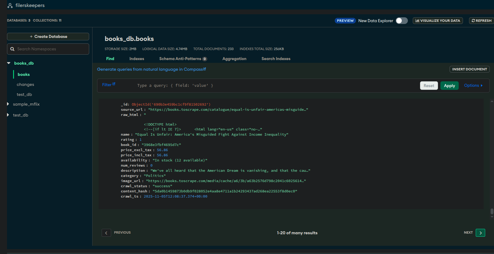
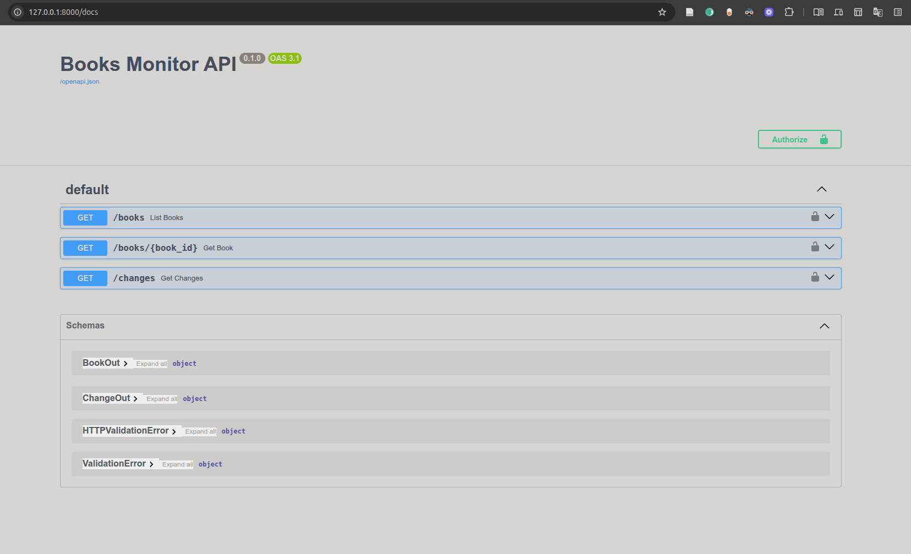
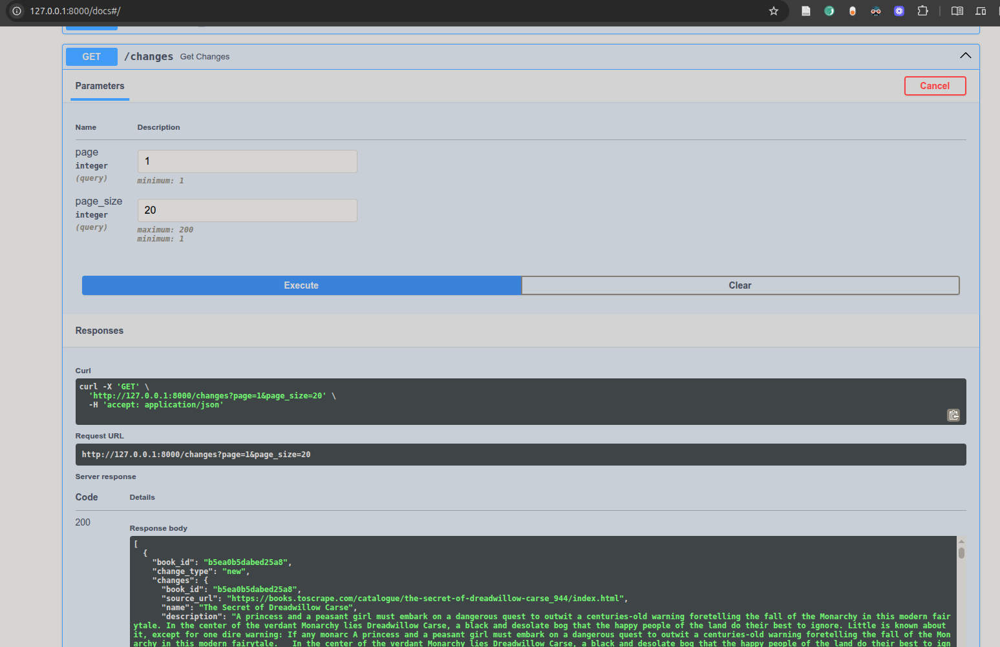
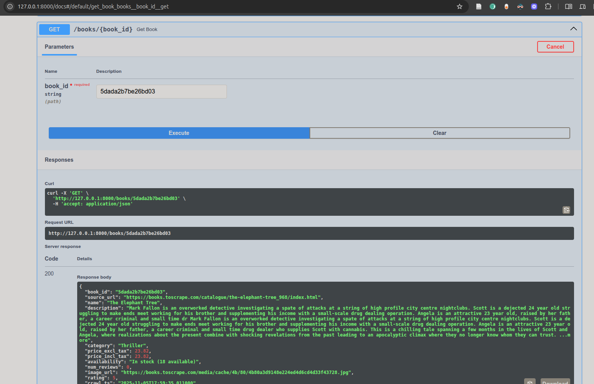

# Books Monitor (Scrapy + FastAPI + Scheduler)

## Overview

Crawls https://books.toscrape.com, stores book data in MongoDB, detects changes, and exposes a secured REST API.

**Features:**
- ✅ **Dual Crawlers**: Scrapy spider + Async httpx crawler with Pydantic schemas
- ✅ **MongoDB Pipeline**: Deduplicates by `book_id` (UPC), computes `content_hash`, logs changes
- ✅ **Change Detection**: Hash-based fingerprinting with detailed change logs
- ✅ **Scheduler**: APScheduler runs daily crawls and generates JSON reports
- ✅ **REST API**: FastAPI with filtering, pagination, sorting, API key auth, and rate limiting
- ✅ **Logging**: File-based logging with timestamps for all crawl operations
- ✅ **Testing**: Comprehensive test suite with pytest
- ✅ **Documentation**: Postman collection and Swagger UI

## Requirements

- Python 3.11+
- MongoDB 4.4+

## Setup

```bash
python -m venv .venv
source .venv/bin/activate
pip install -r requirements.txt
cp .env.example .env
```

Update `.env` with your Mongo URI and API key.

## Run Crawls

### Option 1: Scrapy Crawler (Sync)

```bash
cd web_crawler
scrapy crawl books -s JOBDIR=.job/books_run -s LOG_LEVEL=INFO
```

With HTTP cache for development:
```bash
scrapy crawl books -s HTTPCACHE_ENABLED=true -s JOBDIR=.job/books_run
```

### Option 2: Async Crawler (httpx + Pydantic)

```bash
python -m crawler.async_crawler
```

Features:
- Fully async with httpx
- Pydantic schema validation
- Configurable concurrency
- Exponential backoff retry logic
- Same MongoDB storage as Scrapy

## Run API

```bash
uvicorn api.main:app --reload
```

Use header `X-API-Key: <your_api_key>`.

- `GET /books?category=Poetry&min_price=10&max_price=30&rating=4&sort_by=rating&page=1&page_size=20`
- `GET /books/{book_id}`
- `GET /changes?page=1&page_size=50`

Open Swagger at http://127.0.0.1:8000/docs

## Run Scheduler

```bash
python -m scheduler.daily
```

This schedules a daily run at 02:00 UTC and writes reports to `reports/`.

## Testing

Run all tests:
```bash
pytest
```

Run with coverage:
```bash
pytest --cov=. --cov-report=html --cov-report=term
```

Run specific test file:
```bash
pytest tests/test_api.py -v
pytest tests/test_pipeline.py -v
pytest tests/test_scheduler.py -v
```

**Test Coverage:**
- ✅ API endpoints (authentication, filtering, pagination, sorting)
- ✅ Pipeline logic (hash generation, new books, updates, error handling)
- ✅ Scheduler (crawl execution, report generation)
- ✅ Rate limiting
- ✅ Change detection

## API Testing

### Postman Collection

Import `postman_collection.json` into Postman to test all API endpoints.

Collection includes:
- All CRUD operations
- Filter and sort combinations
- Authentication tests
- Pagination examples
- OpenAPI documentation links

### Using cURL

```bash
# List books
curl -H "X-API-Key: your-key" http://127.0.0.1:8000/books

# Filter by category and price
curl -H "X-API-Key: your-key" "http://127.0.0.1:8000/books?category=Fiction&min_price=10&max_price=30"

# Get specific book
curl -H "X-API-Key: your-key" http://127.0.0.1:8000/books/abc123

# View changes
curl -H "X-API-Key: your-key" http://127.0.0.1:8000/changes
```

## Logging

Crawl logs are automatically saved to `logs/` directory with timestamps.

View recent logs:
```bash
ls -lht logs/
tail -f logs/crawl_*.log
```

Logs include:
- Crawl start/end times
- Books inserted/updated
- Change detection details
- Error messages and retries
- Performance statistics

## Sample Mongo Documents

`books`:
```json
{
  "book_id": "a1b2c3",
  "name": "Book Title",
  "category": "Poetry",
  "price_incl_tax": 12.99,
  "rating": 4,
  "crawl_ts": "2025-01-01T00:00:00Z",
  "raw_html": "...",
  "content_hash": "sha256..."
}
```

`changes`:
```json
{
  "book_id": "a1b2c3",
  "change_type": "update",
  "changes": {"price_incl_tax": {"old": 10.99, "new": 12.99}},
  "changed_at": "2025-01-02T00:00:00Z"
}
```


## screenshots
1. MongoDB overview on cloud.mongodb.com

2. FastAPI Swagger UI

3. FastAPI docs 

4. Books GET API 

